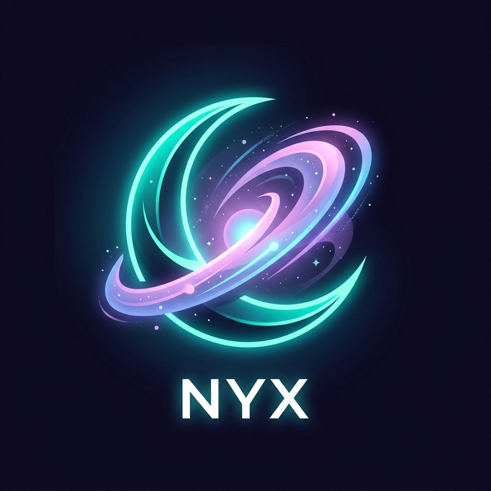

#  Nyx Theme Suite

A professional, high-contrast theme suite ported directly from the popular IntelliJ **True Dark** plugin (v3.0.0). Designed to eliminate clutter, optimize visual hierarchy, and offer the highest contrast ratios for developer focus.

---

## 🎨 Theme Variants

The extension features **6 distinct theme configurations** designed for maximum focus and visual comfort:

### 1. Dark Themes (`#121212`)
- **Nyx Dark**: Elegant dark grey/almost black background flat across all panels for unified aesthetics.
- **Nyx Dark Islands**: The same refined color palette, but with contrasting sidebar and status panel backgrounds to make the editor stand out as a clean, centered "island".

### 2. Black Themes (`#000000`)
- **Nyx Black**: Pure pitch-black background flat across the entire editor and sidebar to maximize contrast, perfect for OLED screens and reducing eye strain.
- **Nyx Black Islands**: A pure black editor framed by dark grey sidebar panels for a structured layout.

### 3. Light Themes (`#F2F4FE`)
- **Nyx Light**: An exceptionally clean light theme with a cool, soft blue-white background.
- **Nyx Light Islands**: The same premium light palette, featuring a pure white editor contrasted by soft blue-white side panels.

---

## 💡 Key Features

- **Perfect Contrast Ratio**: Meticulously designed text token styling (pastel pinks, teals, and soft purples) ensures everything is instantly readable.
- **Islands Layout Option**: Use the "Islands" variant of any theme to get contrasting panels that separate the editor view from surrounding sidebar UI.
- **Pure Black (OLED) Support**: The **Nyx Black** variant uses pure black (`#000000`) to save battery on OLED screens and minimize screen glare.

---

## 🚀 Installation & Usage

1. Open **Visual Studio Code**.
2. Launch the Quick Open console via `Ctrl+P` (or `Cmd+P` on macOS).
3. Type `ext install nyxthemesuite` and press **Enter**.
4. Once installed, activate the theme using `Ctrl+K Ctrl+T` (or `Cmd+K Cmd+T`).
5. Choose one of the 6 variants:
   - **Nyx Dark**
   - **Nyx Dark Islands**
   - **Nyx Black**
   - **Nyx Black Islands**
   - **Nyx Light**
   - **Nyx Light Islands**

---

## 🌟 Recommendations

To achieve the original minimalist look:
- **Hide non-essential UI**: Toggle off the activity bar, panel, or status bar if you prefer keyboard-driven navigation.
- **Font**: Pair it with an elegant developer font like *JetBrains Mono*, *Fira Code*, or *SF Mono*.

**Enjoy a clean, focused coding workspace!**
